# Customizing Visual Emotion Evaluation for MLLMs  

[](https://arxiv.org/abs/2509.21950)  [](https://huggingface.co/datasets/wudq/MVEI/tree/main/MVEI)  [](https://huggingface.co/datasets/wudq/INSETS-462k)

> **Expanded release:** For the EmObserver model, four-stage training code, expanded evaluation suite, and MVEI_PLUS data, see [wdqqdw/EmObserver](https://github.com/wdqqdw/EmObserver), [wudq/EmObserver](https://huggingface.co/wudq/EmObserver), and [wudq/MVEI_PLUS](https://huggingface.co/datasets/wudq/MVEI_PLUS).

Project page of:  
**Customizing Visual Emotion Evaluation for MLLMs: An Open-Vocabulary, Multifaceted, and Scalable Approach**  
*Daiqing Wu, Dongbao Yang, Sicheng Zhao, Can Ma, Yu Zhou*  

---

## 📖 Overview  

This repository provides the **code and data** introduced in our paper.  
We propose a comprehensive framework for evaluating the visual emotion intelligence of **Multimodal Large Language Models (MLLMs)**, consisting of four key components:

- **ESJ Task**: A judgment-based evaluation task to assess MLLMs' emotion perception.
- **INSETS Pipeline**: An automated pipeline for open-vocabulary labels and multi-faceted emotion statements.  
- **INSETS-462k Dataset**: A large-scale automatically annotated corpus for ESJ.
- **MVEI**: A human-refined benchmark for multifaceted visual emotion intelligence evaluation.

---

## ESJ Task

The **Emotion Statement Judgment (ESJ)** task reformulates visual emotion evaluation by requiring MLLMs to validate whether a given emotion-centric statement accurately describes the emotional content of an image. This approach mitigates the ambiguity of open-ended responses and supports extensible evaluation across multiple affective dimensions.

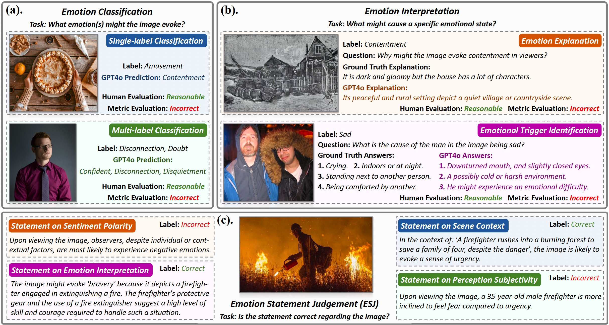
<div align="center">
<em>Figure 1: Comparison between traditional emotion evaluation approaches and the proposed ESJ task.</em>
</div>

---

## Evaluation on MVEI

We provide scripts for running inference and evaluating models on MVEI.

**Step 1. Dataset Preparation**

To evaluate MLLMs on MVEI, first download the dataset from [https://huggingface.co/wudq/MVEI](https://huggingface.co/wudq/MVEI) to `path/to/your/dataset`, and then unzip `images.zip`.
The annotations of MVEI are stored in `MVEI_metadata.json`, which is a list where each entry corresponds to one image. An example annotation is shown below:

```json
{
  "image_id": "contentment/contentment_14236.jpg",
  "ov_emotion": [
    "tranquility",
    "contentment"
  ],
  "statement_list": [
    {
      "statement": "Upon viewing this image, observers, despite various individual or contextual factors, are most likely to experience negative emotions.",
      "label": "incorrect",
      "class": "sentiment polarity",
      "subclass": "none"
    }
  ]
}
```

**Step 2. Model Inference**

Run inference with the MLLM to be evaluated and store the predictions. We provide an example for evaluating [Qwen2.5-VL-Instruct](https://huggingface.co/Qwen/Qwen2.5-VL-7B-Instruct) in `eval/infer_example.py`.

To run the script, modify:
- `--MVEI_path` to `path/to/your/dataset`.
- `--model_path` to `path/to/downloaded/Qwen2.5-VL-Instruct`.

After modification, running the script will store the inference results by default at `path/to/your/dataset/predictions/MVEI_predict.json`. This process takes approximately 20 minutes on a single A100 GPU. The script augments each statement with a `predict` key. An example entry is shown below:

```json
{
  "image_id": "contentment/contentment_14236.jpg",
  "ov_emotion": [
    "tranquility",
    "contentment"
  ],
  "statement_list": [
    {
      "statement": "Upon viewing this image, observers, despite various individual or contextual factors, are most likely to experience negative emotions.",
      "label": "incorrect",
      "class": "sentiment polarity",
      "subclass": "none"
      "predict": "Incorrect"
    }
  ]
}
```

**Step 3. Metric Calculation**

Run `eval/cal_metrics.py` to compute evaluation metrics based on the predictions. Modify:
- `--input_json` to the path of the prediction file (e.g., `path/to/your/dataset/predictions/MVEI_predict.json`).
- `--output_txt` to a desired output path, where the final evaluation results will be saved.

---

## INSETS Pipeline

The **INSETS** pipeline (**I**ntelligent **Vi**sual **E**motion **T**agger and **S**tatement **C**onstructor) automatically constructs emotion-centric statements for ESJ with minimal human effort. It operates in two main stages:

**Open-Vocabulary Emotion Tagging**: Assigns fine-grained emotion labels to images using an ensemble of MLLMs and maps them to Parrott's hierarchical emotion model.
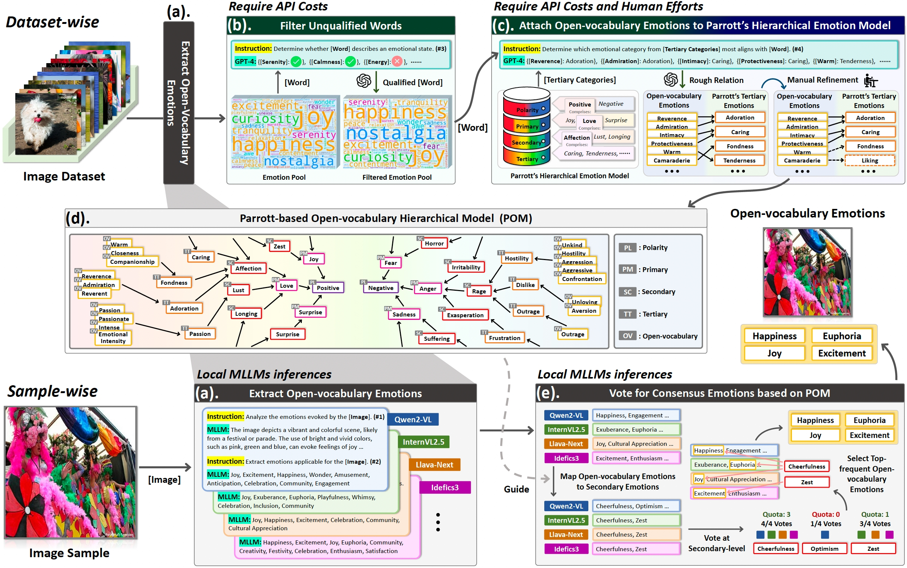
<div align="center">
<em>Figure 2: The open-vocabulary emotion tagging stage of INSETS.</em>
</div>

<br><br>
**Emotion Statement Construction**: Generates diverse statements covering four evaluation dimensions: sentiment polarity, emotion interpretation, scene context, and perception subjectivity.
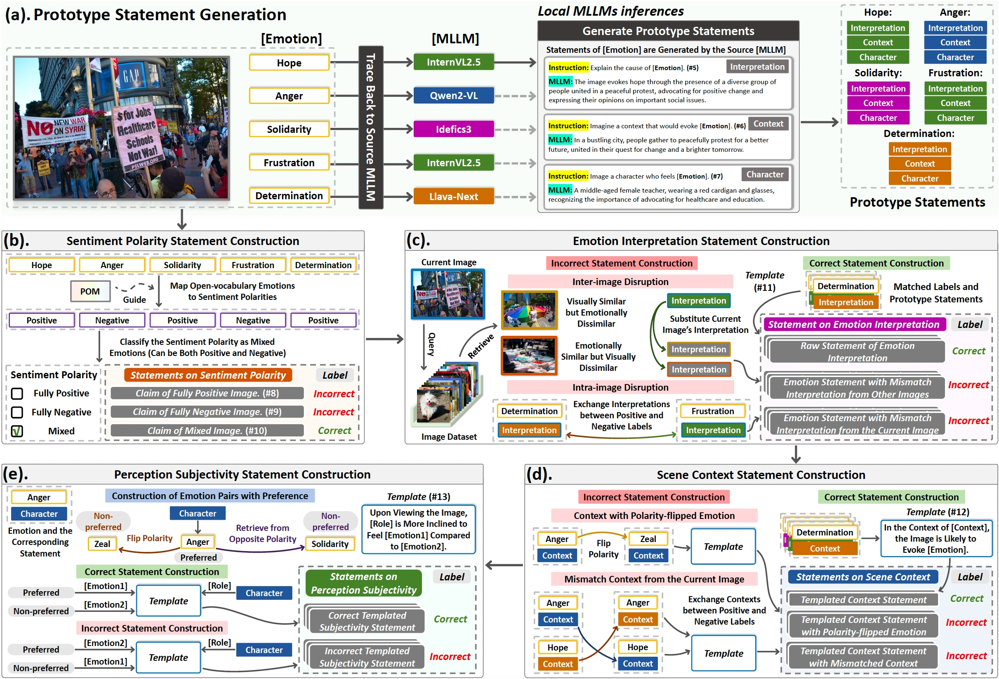
<div align="center">
<em>Figure 3: The emotion statement construction stage of INSETS.</em>
</div>

---

## INSETS-462k & MVEI Benchmark

- **INSETS-462k** is a large-scale corpus containing 462,369 emotion-centric statements derived from 17,716 images, annotated automatically via the INSETS pipeline.
- **MVEI** is a carefully human-refined benchmark comprising 3,086 high-quality image-statement pairs, designed for comprehensive evaluation of MLLMs' visual emotion intelligence.
- We gratefully acknowledge the [EmoSet](https://vcc.tech/EmoSet) dataset as the source of all images used in INSETS-462k and MVEI.

<table>
<tr>
<td align="center">
<em>Table 1: Overall statistics.</em>
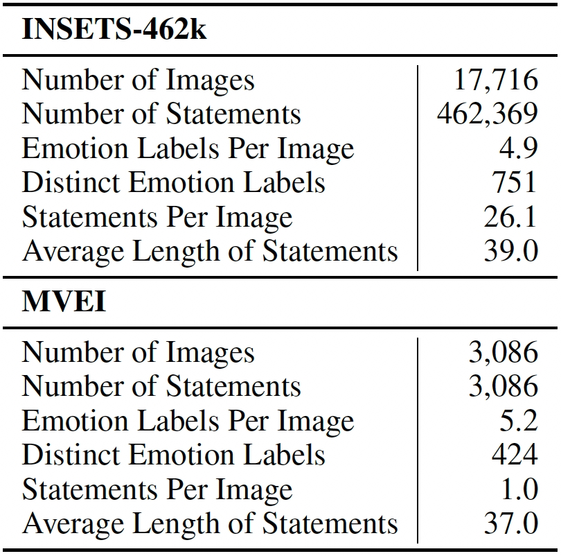
<br>
</td>
<td align="center">
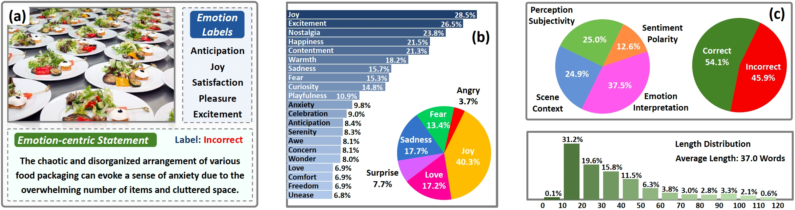
<br>
<em>Figure 4: Detailed statistics of MVEI.</em>
</td>
</tr>
</table>

---

## Evaluation of MLLMs on MVEI
We evaluate a wide range of MLLMs on the MVEI benchmark. Below are the accuracy results across four affective cognitive dimensions:

<div align="center">
<em>Table 2: Accuracy evaluation of popular MLLMs on MVEI.</em>
</div>

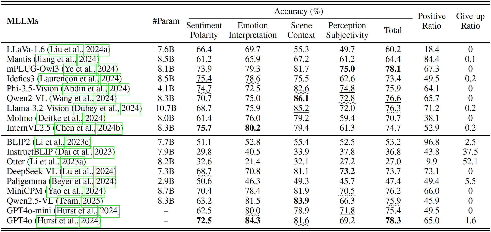

<div align="center">
<em>Table 3: Comparison with human performance on MVEI.</em>
</div>

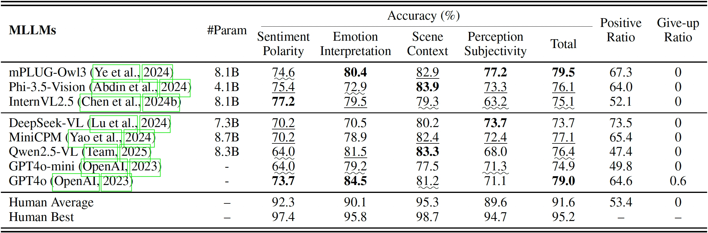


---

## Visualization of MVEI

<table>
<tr>
<td align="center">
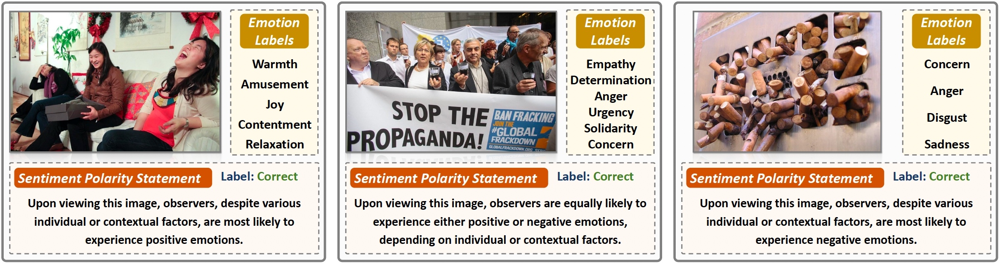
<br>
<em>Figure 5: Sentiment polarity statements labeled as correct.</em>
</td>
<td align="center">
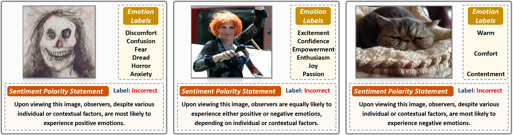
<br>
<em>Figure 6: Sentiment polarity statements labeled as incorrect.</em>
</td>
</tr>
</table>

<table>
<tr>
<td align="center">
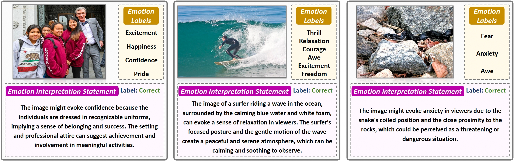
<br>
<em>Figure 7: Emotion interpretation statements labeled as correct.</em>
</td>
<td align="center">
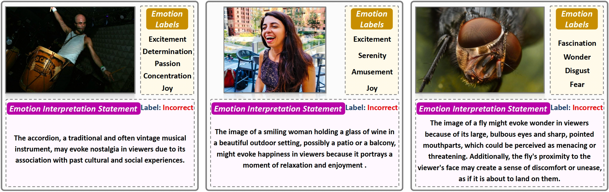
<br>
<em>Figure 8: Emotion interpretation statements labeled as incorrect.</em>
</td>
</tr>
</table>

<table>
<tr>
<td align="center">
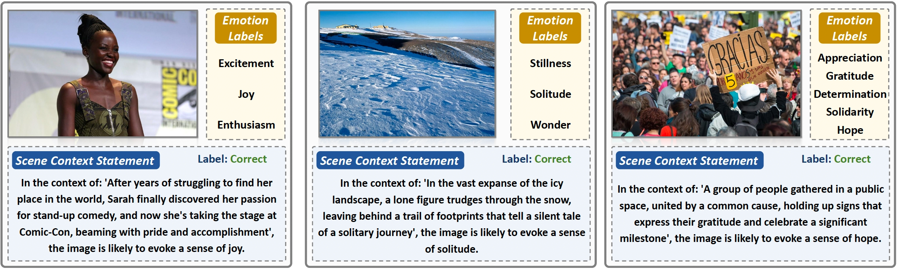
<br>
<em>Figure 9: Scene context statements labeled as correct.</em>
</td>
<td align="center">
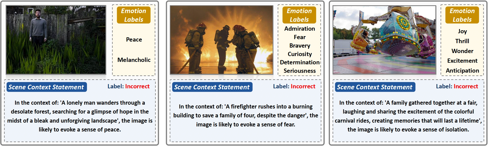
<br>
<em>Figure 10: Scene context statements labeled as incorrect.</em>
</td>
</tr>
</table>

<table>
<tr>
<td align="center">
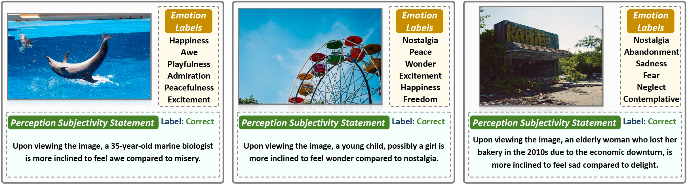
<br>
<em>Figure 11: Perception subjectivity statements labeled as correct.</em>
</td>
<td align="center">
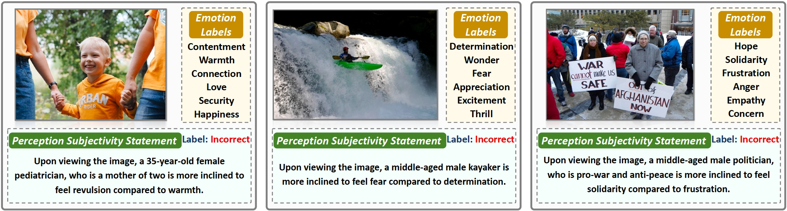
<br>
<em>Figure 12: Perception subjectivity statements labeled as incorrect.</em>
</td>
</tr>
</table>

## 📌 Citation
If you find this work useful, please consider citing our paper:
<pre>
@inproceedings{wu2026mvei,
  title = {Customizing Visual Emotion Evaluation for MLLMs: An Open-Vocabulary, Multifaceted, and Scalable Approach},
  author = {Daiqing Wu and Dongbao Yang and Sicheng Zhao and Can Ma and Yu Zhou},
  booktitle = {The Fourteenth International Conference on Learning Representations},
  year = {2026},
  url = {https://openreview.net/forum?id=dQTSXWqZws}
}
