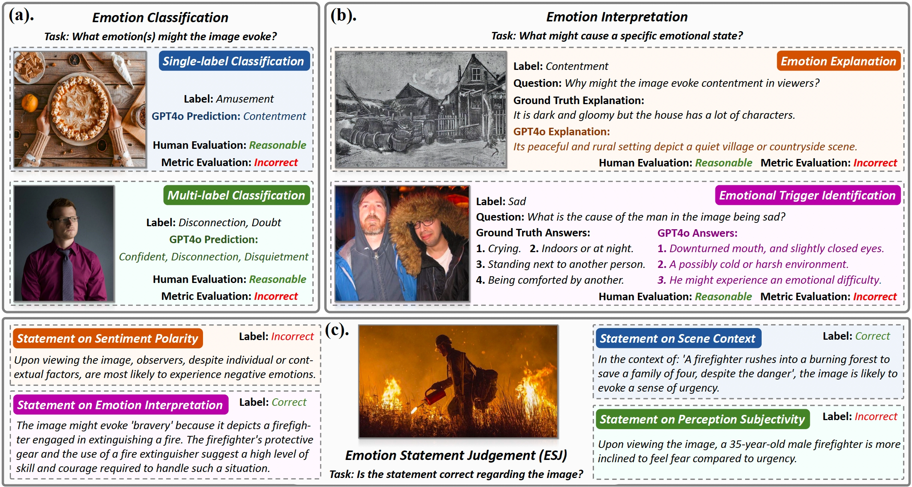

# Customizing Visual Emotion Evaluation for MLLMs  

    

Project page of:  
**Customizing Visual Emotion Evaluation for MLLMs: An Open-Vocabulary, Multifaceted, and Scalable Approach**  
*Daiqing Wu, Dongbao Yang, Sicheng Zhao, Can Ma, Yu Zhou*  

---

## 📖 Overview  

This repository provides the **code and data** introduced in our paper.  
We propose a comprehensive framework for evaluating the visual emotion intelligence of **Multimodal Large Language Models (MLLMs)**, consisting of four key components:

- **ESJ Task**: A judgment-based evaluation task to assess MLLMs' emotion perception.
- **INSETS Pipeline**: An automated pipeline for open-vocabulary labels and multi-faceted emotion statements.  
- **INSETS-462k Dataset**: A large-scale automatically annotated corpus for ESJ.
- **MVEI**: A human-refined benchmark for multifaceted visual emotion intelligence evaluation.

---

## ESJ Task

The **Emotion Statement Judgment (ESJ)** task reformulates visual emotion evaluation by requiring MLLMs to validate whether a given emotion-centric statement accurately describes the emotional content of an image. This approach mitigates the ambiguity of open-ended responses and supports extensible evaluation across multiple affective dimensions.

*Figure 1: Comparison between traditional emotion evaluation approaches and the proposed ESJ task.*

---

## INSETS Pipeline

The **INSETS** pipeline (**I**ntelligent **Vi**sual **E**motion **T**agger and **S**tatement **C**onstructor) automatically constructs emotion-centric statements for ESJ with minimal human effort. It operates in two main stages:

**Open-Vocabulary Emotion Tagging**: Assigns fine-grained emotion labels to images using an ensemble of MLLMs and maps them to Parrott's hierarchical emotion model.

*Figure 2: The open-vocabulary emotion tagging stage of INSETS.*

**Emotion Statement Construction**: Generates diverse statements covering four evaluation dimensions: sentiment polarity, emotion interpretation, scene context, and perception subjectivity.

*Figure 3: The emotion statement construction stage of INSETS.*

---

## INSETS-462k & MVEI

- **INSETS-462k** is a large-scale corpus containing 462,369 emotion-centric statements derived from 17,716 images, annotated automatically via the INSETS pipeline.
- **MVEI** is a carefully human-refined benchmark comprising 3,086 high-quality image-statement pairs, designed for comprehensive evaluation of MLLMs' visual emotion intelligence.

<table>
<tr>
<td align="center">

 
<em>*Table 1: Overall statistics.*</em>
</td>
<td align="center">

 
<em>*Figure 4: Detailed statistics of MVEI.*</em>
</td>
</tr>
</table>

*Table 4: Sample visualization from the MVEI benchmark.*

---
